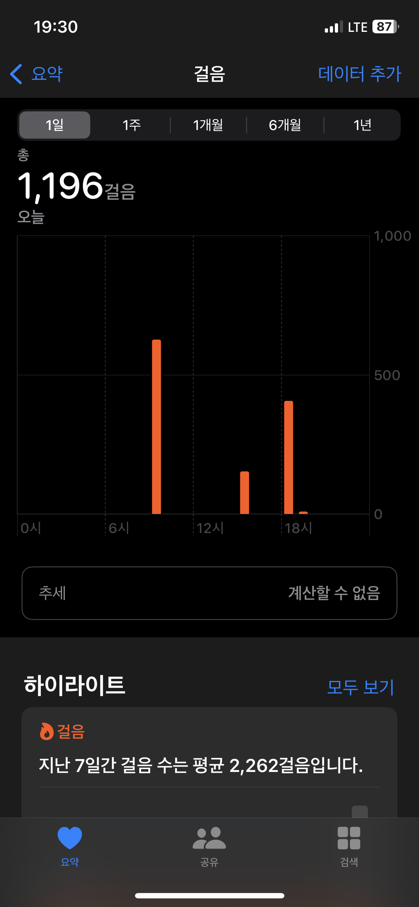
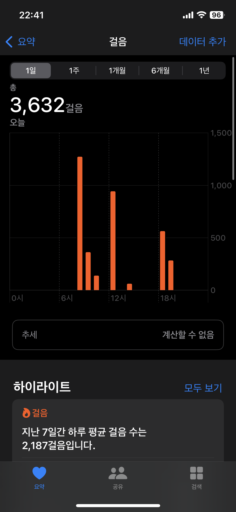

# 퀘스트 수행하기

## K043 임형준

### 퀘스트 : 1.스트레칭

### 선정 이유 :

요즘 매일 앉아있으니 허리가 아프다… 더 늙기전에 허리 건강을 챙겨야 겠다….

## S059 임해인

### 퀘스트 : 6.시 읽기

### 선정 이유 :

평소에 시를 자주 읽어서 보다 수월한 퀘스트라고 생각했습니다

## J094 문준호

### 퀘스트 : 5. 인적 네트워크를 통한 성장하기

### 선정 이유

커뮤니케이션을 활용하지 못하고 있는 것 같아서 마지막주를 퀘스르틑 통해서라도 참여를 해보아야겠다고 생각했습니다.

## J131 서완석

### 퀘스트 : 2 산책

### 선정 이유

걸으면서 건강을 챙기고 싶다!!

### 수행 내용

- 월요일

- 화요일

## J261 최재원

### 퀘스트 : 4. 실수노트 작성

### 선정 이유 :

Basic 과정에서 진행했던 `실수축제`가 좋은 경험이었다고 생각해서 한번 더 진행해 보고 싶다.
